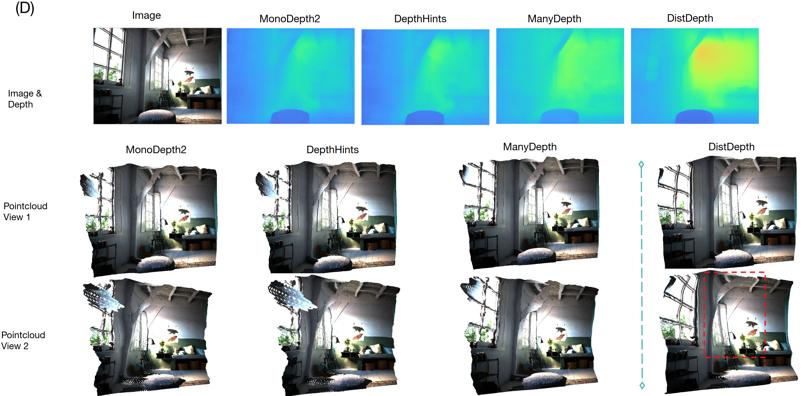

# <div align=""> Toward Practical Monocular Indoor Depth Estimation </div>

<a href="https://choyingw.github.io/">Cho-Ying Wu</a>, <a href="https://sites.google.com/view/jialiangwang/home">Jialiang Wang</a>, <a href="https://www.linkedin.com/in/michaelanthonyhall/">Michael Hall</a>, <a href="https://cgit.usc.edu/contact/ulrich-neumann/">Ulrich Neumann</a>, <a href="https://shuochsu.github.io/">Shuochen Su</a>

[<a href="https://arxiv.org/abs/2112.02306">arXiv</a>] [<a href="https://distdepth.github.io/">project site: data, supplementary</a>]




### DistDepth
Our DistDepth is a highly robust monocular depth estimation approach for generic indoor scenes.
* Trained with stereo sequences without their groundtruth depth
* Structured and metric-accurate
* Run in an interactive rate with Laptop GPU
* Sim-to-real: trained on simulation and becomes transferrable to real scenes

## <div align="">Single Image Inference Demo</div>

We test on Ubuntu 20.04 LTS with an laptop NVIDIA 2080 GPU (only GPU mode is supported).

Install packages

1. Use conda

    ``` conda create --name distdepth python=3.8 ```
    ``` conda activate distdepth ```

2. Install pre-requisite common packages. Go to https://pytorch.org/get-started/locally/ and install pytorch that is compatible to your computer. We test on pytorch v1.9.0 and cudatoolkit-11.1. (The codes should work under other v1.0+ versions)

    ```conda install pytorch==1.9.0 torchvision==0.10.0 torchaudio==0.9.0 cudatoolkit=11.3 -c pytorch -c conda-forge ```

3. Install other dependencies: opencv-python and matplotlib.

   ``` pip install opencv-python, matplotlib ```

Download pretrained models

4. Download pretrained models [<a href="https://drive.google.com/file/d/1N3UAeSR5sa7KcMJAeKU961KUNBZ6vIgi/view?usp=sharing">here</a>] (ResNet152, 246MB).

5. Move the downloaded item under this folder, and then unzip it. You should be able to see a new folder 'ckpts' that contains the pretrained models.

6. Run

   ``` python demo.py ```

7. Results will be stored under `results/`

## <div align=""> Data</div>

Download SimSIN [<a href="https://drive.google.com/file/d/1P93270GM_gbx3Cc-b5lLdHOr9P9ZWyLO/view?usp=sharing">here</a>]. For UniSIN and VA, please download at the [<a href="https://distdepth.github.io/">project site</a>].

## <div align="">Depth-aware AR effects</div>

Virtual object insertion:


Dragging objects along a trajectory:


## <div align="">Citation</div>

    @inproceedings{wu2022toward,
    title={Toward Practical Monocular Indoor Depth Estimation},
    author={Wu, Cho-Ying and Wang, Jialiang and Hall, Michael and Neumann, Ulrich and Su, Shuochen},
    booktitle={CVPR},
    year={2022}
    }

## License
DistDepth is CC-BY-NC licensed, as found in the LICENSE file.
