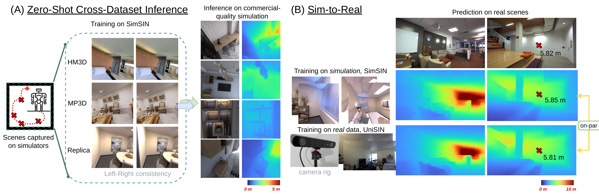
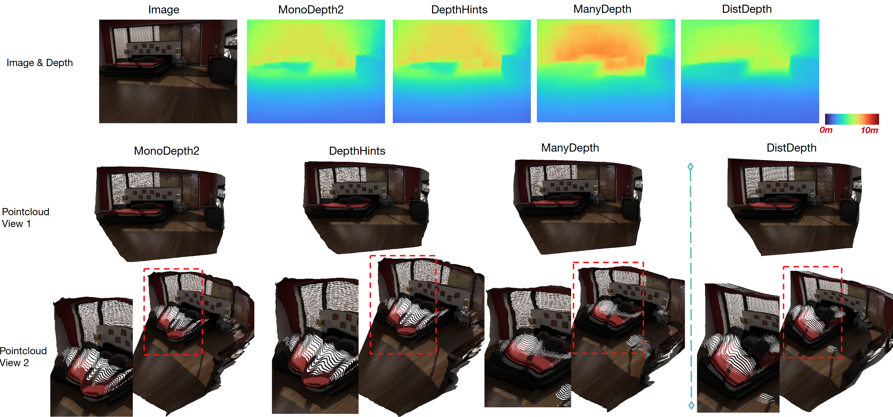
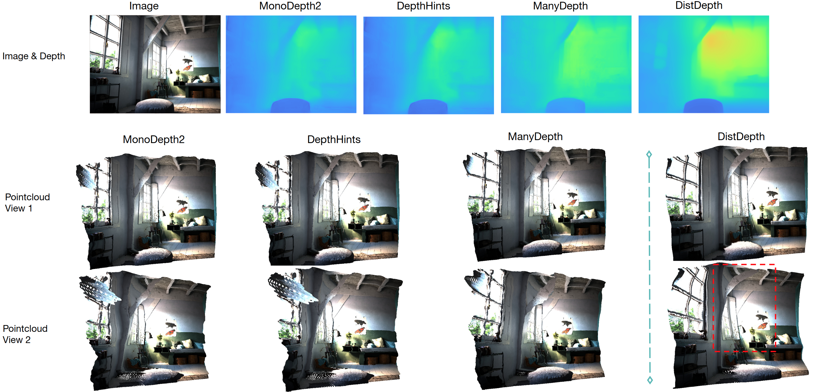
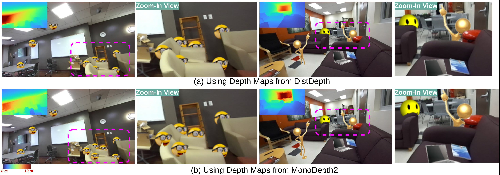

# <div align=""> Toward Practical Monocular Indoor Depth Estimation </div>

<a href="https://choyingw.github.io/">Cho-Ying Wu</a>, <a href="https://sites.google.com/view/jialiangwang/home">Jialiang Wang</a>, <a href="https://www.linkedin.com/in/michaelanthonyhall/">Michael Hall</a>, <a href="https://cgit.usc.edu/contact/ulrich-neumann/">Ulrich Neumann</a>, <a href="https://shuochsu.github.io/">Shuochen Su</a>

[<a href="https://arxiv.org/abs/2112.02306">arXiv</a>] [<a href="https://openaccess.thecvf.com/content/CVPR2022/html/Wu_Toward_Practical_Monocular_Indoor_Depth_Estimation_CVPR_2022_paper.html">CVF open access</a>] [<a href="https://distdepth.github.io/">project site: data, supplementary</a>]

As this project includes data contribution, please refer to the project page for data download instructions, including SimSIN, UniSIN, and VA, as well as UniSIN leaderboard participation.

Advantage


Results



### DistDepth
Our DistDepth is a highly robust monocular depth estimation approach for generic indoor scenes.
* Trained with stereo sequences without their groundtruth depth
* Structured and metric-accurate
* Run in an interactive rate with Laptop GPU
* Sim-to-real: trained on simulation and becomes transferrable to real scenes

## <div align="">Single Image Inference Demo</div>

We test on Ubuntu 20.04 LTS with an laptop NVIDIA 2080 GPU.

Install packages

1. Use conda

    ``` conda create --name distdepth python=3.8 ```
    ``` conda activate distdepth ```

2. Install pre-requisite common packages. Go to https://pytorch.org/get-started/locally/ and install pytorch that is compatible to your computer. We test on pytorch v1.9.0 and cudatoolkit-11.1. (The codes should work under other v1.0+ versions)

3. Install other dependencies: opencv-python and matplotlib, imageio, Pillow, augly, tensorboardX

   ``` pip install opencv-python, matplotlib, imageio, Pillow, augly, tensorboardX ```

Download pretrained models

4. Download pretrained models [<a href="https://drive.google.com/file/d/1N3UAeSR5sa7KcMJAeKU961KUNBZ6vIgi/view?usp=sharing">here</a>] (ResNet152, 246MB, illustation for averagely good in-the-wild indoor scenes).

5. Unzip under the root. 'ckpts' that contains the pretrained models is created.

6. Run

   ``` python demo.py ```

7. Results will be stored under `results/`

## <div align="">Pointcloud Generation</div>

Some Sample data are provided in `data/sample_pc`.

   ``` python visualize_pc.py ```


## <div align=""> Data</div>

Download SimSIN [<a href="https://drive.google.com/file/d/1P93270GM_gbx3Cc-b5lLdHOr9P9ZWyLO/view?usp=sharing">here</a>]. For UniSIN and VA, please download at the [<a href="https://distdepth.github.io/">project site</a>].

To generate stereo data with depth using Habitat, we provide a snippet here. Install <a href="https://github.com/facebookresearch/habitat-sim">Habitat</a> first.  

   ``` python visualize_pc.py ```

## <div align=""> Training</div>

For a simple taste of training, download a smaller replica set [<a href="https://drive.google.com/file/d/1g-OXOsKeincRc1-O3x42wVRFKpog2aRe/view?usp=sharing">here</a>] and create and put under './SimSIN-simple'.

   ``` mkdir weights ```
   
```shell
wget -O weights/dpt_hybrid_nyu-2ce69ec7.pt https://github.com/intel-isl/DPT/releases/download/1_0/dpt_hybrid_nyu-2ce69ec7.pt 
```

```shell
python execute.py --exe train --model_name distdepth-distilled --frame_ids 0 --log_dir='./tmp' --data_path SimSIN-simple --dataset SimSIN  --batch_size 12 --width 256 --height 256 --max_depth 10.0  --num_epochs 10 --scheduler_step_size 8 --learning_rate 0.0001 --use_stereo  --thre 0.95 --num_layers 152 
```

The memory takes about 18G and requires about 20 min on a RTX 3090 GPU.

## <div align=""> Evaluation</div>

SimSIN trained models, evaluation on VA

| Name | Arch | Expert | MAE | AbsRel | RMSE | acc@ 1.25 | acc@ 1.25^2 | acc@ 1.25^3 | Download |
| --- | --- | --- | --- | --- | --- | --- | --- | --- | --- |
| DistDepth | ResNet152 | DPT Large | 0.252 | 0.175 | 0.371 | 75.1 | 93.9 | 98.4 | [model](https://drive.google.com/file/d/1X_VMg1LYLmm8xCloLRjqHtIslyXfOrn5/view?usp=sharing) |
| DistDepth | ResNet152 | DPT Legacy | 0.270 | 0.186 | 0.386 | 73.2 | 93.2 | 97.9 | [model](https://drive.google.com/file/d/1rTBSglo_h-Ke5HMe4xvHhCjpeBDRl6vx/view?usp=sharing) |
| DistDepth-Multi| ResNet101 | DPT Legacy | 0.243 | 0.169 | 0.362 | 77.1 | 93.7 | 97.9 | [model](https://drive.google.com/file/d/1Sg_dXAyKI2VfKzHiAu9i8WqT9I7Y9k0D/view?usp=sharing) |


Download VA (8G) first. Extract under the root folder.

      .
      ├── VA
            ├── camera_0
               ├── 00000000.png 
                   ......
            ├── camera_1
               ├── 00000000.png 
                   ......
            ├── gt_depth_rectify
               ├── cam0_frame0000.depth.pfm 
                   ......
            ├── VA_left_all.txt

Run   ``` bash eval.sh ```   The performances will be saved under the root folder.

To visualize the predicted depth maps in a minibatch: 

```shell
python execute.py --exe eval_save --log_dir='./tmp' --data_path VA --dataset VA  --batch_size 1 --load_weights_folder <path to weights> --models_to_load encoder depth  --width 256 --height 256 --max_depth 10 --frame_ids 0 --num_layers 152 ```
```

To visualize the predicted depth maps for all testing data on the list: 

```shell
python execute.py --exe eval_save_all --log_dir='./tmp' --data_path VA --dataset VA  --batch_size 1 --load_weights_folder <path to weights> --models_to_load encoder depth  --width 256 --height 256 --max_depth 10 --frame_ids 0 --num_layers 152 ```
```

Evaluation on NYUv2

Prepare <a href="https://cs.nyu.edu/~silberman/datasets/nyu_depth_v2.html">NYUv2</a> data.

      .
      ├── NYUv2
            ├── img_val
               ├── 00001.png
               ......
            ├── depth_val
               ├── 00001.npy
               ......
               ......
            ├── NYUv2.txt

| Name | Arch | Expert | MAE | AbsRel | RMSE | acc@ 1.25 | acc@ 1.25^2 | acc@ 1.25^3 | Download |
| --- | --- | --- | --- | --- | --- | --- | --- | --- | --- |
| DistDepth-finetuned | ResNet152 | DPT on NYUv2 | 0.308 | 0.113 | 0.444 | 87.3 | 97.3 | 99.3 | [model](https://drive.google.com/file/d/1kLJBuMOf0xSpYq7DtxnPpBTxMwW0ylGm/view?usp=sharing) |
| DistDepth-SimSIN | ResNet152 | DPT | 0.411 | 0.163 | 0.563 | 78.0 | 93.6 | 98.1 | [model](https://drive.google.com/file/d/1Hf_WPaBGMpPBFymCwmN8Xh1blXXZU1cd/view?usp=sharing) |

Change train_filenames (dummy) and val_filenames in execute_func.py to NYUv2. Then,

```shell
python execute.py --exe eval_measure --log_dir='./tmp' --data_path NYUv2 --dataset NYUv2  --batch_size 1 --load_weights_folder <path to weights> --models_to_load encoder depth  --width 256 --height 256 --max_depth 12 --frame_ids 0 --num_layers 152
```

## <div align="">Depth-aware AR effects</div>

Virtual object insertion:



Dragging objects along a trajectory:


## <div align="">Citation</div>

    @inproceedings{wu2022toward,
    title={Toward Practical Monocular Indoor Depth Estimation},
    author={Wu, Cho-Ying and Wang, Jialiang and Hall, Michael and Neumann, Ulrich and Su, Shuochen},
    booktitle={CVPR},
    year={2022}
    }

## License
DistDepth is CC-BY-NC licensed, as found in the LICENSE file.
